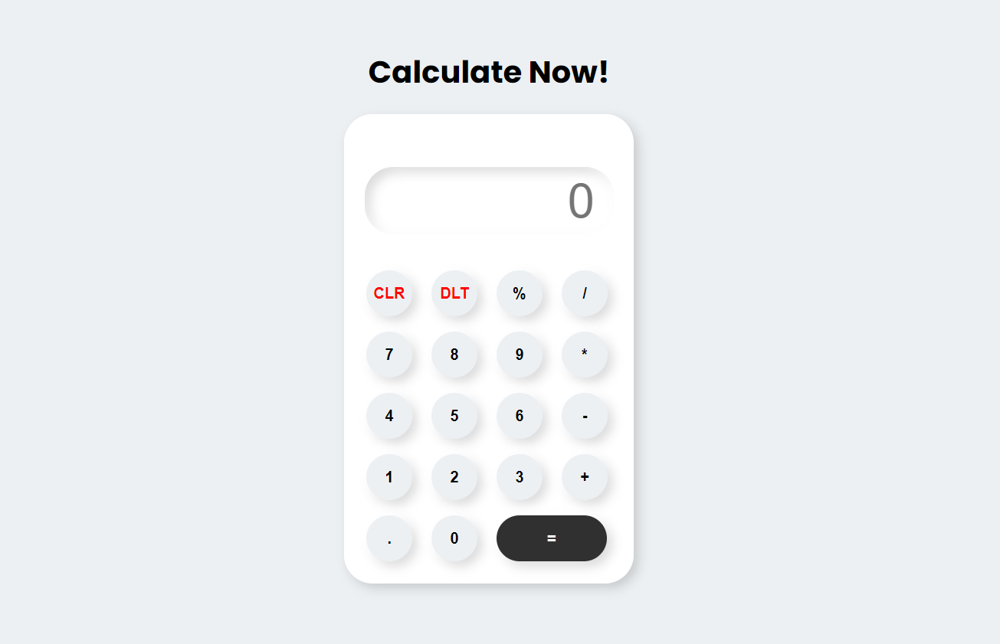

# Calculator

This is calculator which I have created using pure HTML,CSS and JavaScript.

> You can perform all basic operations like addition,substraction,multiplication and division and so on...

[Calculate here](https://hiralvala.github.io/Calculator-using-HTML-CSS-JavaScript/)

